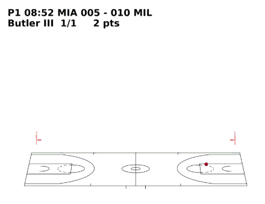

# Animated Play-by-Play 🏀🎬

> As part of the ***2026 Monthly Personal Projects** / February 2 of 12*

A 3D animated visualization of NBA play-by-play shot data from a single
playoff game.\
This project transforms raw event-level data into a dynamic, spatial
representation of game flow, team momentum, and individual performance.

------------------------------------------------------------------------

<p align="center">
  
</p>

## Project Objective

The goal of this project is to:

-   Retrieve official NBA play-by-play and shot location data
-   Convert legacy coordinate systems into real-world court geometry
-   Construct a 3D full-court visualization
-   Animate shots sequentially to reflect true game progression
-   Overlay a live scoreboard and optional player-specific tracking

This project is intentionally focused on **data transformation,
visualization, and animation**, rather than predictive modeling.

------------------------------------------------------------------------

## Game Selected

**Miami Heat vs Milwaukee Bucks**\
Eastern Conference First Round -- Game 4\
April 24, 2023

Jimmy Butler scored **56 points** in this game, making it one of the
most iconic playoff performances in recent history.

The game serves as a compelling case study for visualizing shot
progression and momentum due to shot volume, game story, and personal bias :).

Nonetheless, any game in the `nba-api` package can be used along with any player.

------------------------------------------------------------------------

## Data Source

**NBA Stats API (via `nba_api` Python package)**

Data retrieved includes:

-   Event-level play-by-play records\
-   Shot location coordinates (`xLegacy`, `yLegacy`)\
-   Period and game clock\
-   Team identifiers\
-   Running score (`scoreHome`, `scoreAway`)\
-   Shot value (1, 2, or 3 points)

Shot coordinates originate in the NBA "legacy" system: - Origin at the
rim\
- Units in tenths of feet\
- Half-court reference frame

These coordinates were transformed into: - Real-world feet\
- Full-court geometry\
- Center-court origin (0,0)

------------------------------------------------------------------------

## Approach

### 1) Data Processing

The notebook performs:

-   Filtering of shot events from play-by-play
-   Conversion of legacy coordinates into feet
-   Translation of rim-centered coordinates to center-court coordinates
-   Half-based team orientation logic:
    -   First half: Home attacks right side
    -   Second half: Sides swap
-   Forward-filling score values to maintain live scoreboard updates
-   Optional player filtering via `PLAYER` variable

The result is a clean, animation-ready dataset aligned with actual NBA
court dimensions.

------------------------------------------------------------------------

### 2) 3D Court Construction

The 3D court is rendered using:

``` python
from mplbasketball.court3d import draw_court_3d
```

This project uses the **mplbasketball** library for accurate 3D court
geometry and line rendering.

Credit:\
mplbasketball -- [mplbasketball](https://pypi.org/project/mplbasketball/)

Additional configuration includes:

-   Full NBA court dimensions (94 ft × 50 ft)
-   Proper rim offset from baseline
-   Center-court origin (0,0)
-   Broadcast-style camera angle
-   Manual aspect ratio adjustments for realistic proportions

------------------------------------------------------------------------

### 3) Shot Animation

Using `matplotlib.animation.FuncAnimation`, the visualization:

-   Animates shots sequentially in game order
-   Color-codes shots by team
-   Displays made vs missed shots distinctly
-   Leaves a cumulative trail of attempts
-   Updates a dynamic scoreboard overlay

Scoreboard format:

    P1 11:37 MIA 012 - 009 MIL
    J. Butler  3/5     8 pts

The second line is optional and controlled by a `PLAYER` variable.

All statistics update live as the animation progresses.

------------------------------------------------------------------------

## Visualization & Insights

The animated format reveals:

-   Spatial shot clustering by team
-   How shot selection evolves across halves
-   Momentum swings tied to scoring bursts
-   The buildup of individual scoring performances over time

By visualizing shots chronologically rather than statically, the game's
rhythm becomes visible rather than inferred.

------------------------------------------------------------------------

## Results Summary

Key outcomes of this project:

-   Successful conversion of legacy NBA coordinates into real-world
    geometry
-   Accurate full-court representation with correct half-based team
    orientation
-   Shot-by-shot animation aligned with true game progression
-   Live updating scoreboard and optional player performance tracking
-   Clear visual separation of home and away teams

The final output is a reproducible 3D animated play-by-play
visualization.

------------------------------------------------------------------------

## Reproducibility

To run the project:

1.  Install dependencies:

``` bash
pip install nba_api matplotlib pandas numpy mplbasketball
```

2.  Run the notebook from top to bottom.

The animation renders directly inside the notebook environment.

------------------------------------------------------------------------

## Possible Extensions (Out of Scope)

To keep the project tightly scoped, the following were intentionally not
implemented:

-   Win probability modeling and live probability curve overlay
-   Shot trajectory arcs (parabolic 3D flight paths)
-   Interactive dashboard deployment (e.g., Streamlit)
-   Multi-game comparative analysis
-   Advanced player tracking metrics

These represent natural next steps for expanding the project.

------------------------------------------------------------------------

## Author

Jorge
